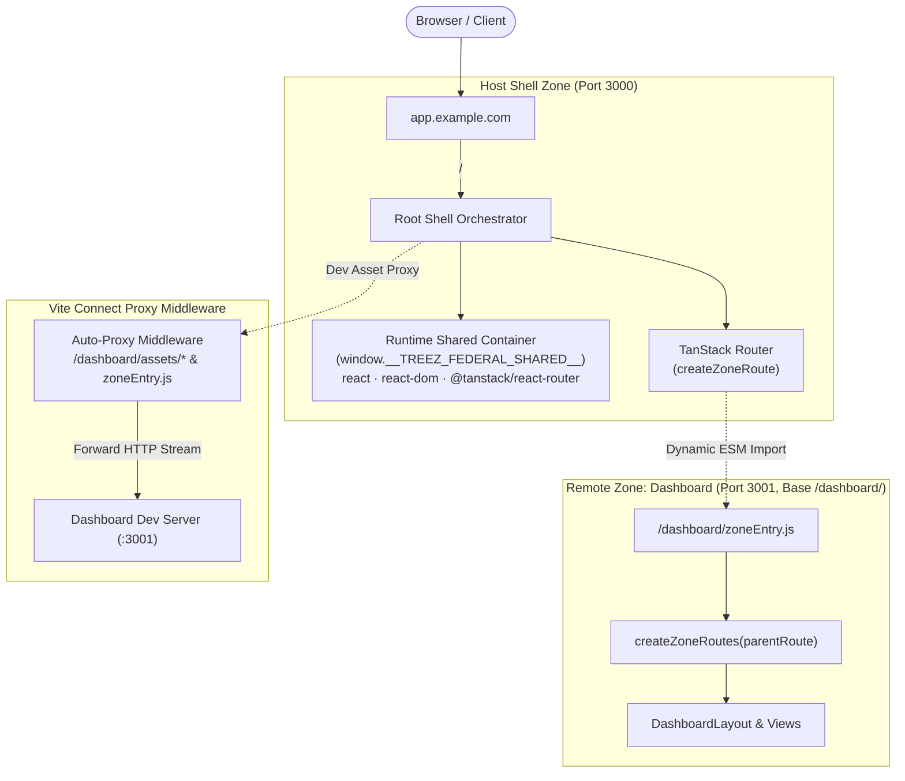

# ⚡ treez-federal

> **Treez Federal - Micro-Frontend Architecture with Vite, Rolldown and TanStack Router.**

`treez-federal` is a library that brings the **Multi-Zones** architecture (popularized by Next.js) into the Vite SPA ecosystem. It enables large frontend teams to split monolithic applications into independently developed, tested, and deployed sub-applications ("zones") while maintaining seamless, client-side SPA navigation without hard page reloads (F5).

---

## 🌟 Key Features

- 🌐 **Path-Based Zone Routing**: Structure your frontend under a single domain (`/` for Root Shell, `/dashboard/*` for Dashboard Zone, `/settings/*` for Settings Zone).
- ⚡ **Zero-Reload Client-Side Transitions**: Navigate across zones smoothly as a Single Page Application, preserving shared layout containers, global memory context, and client state.
- 🔄 **Auto-Proxying Dev Server**: Built-in Vite connect middleware transparently proxies zone requests (`/dashboard/assets/*`, `/dashboard/zoneEntry.js`, and HMR requests) to remote zone dev servers without manual reverse proxies.
- 🧩 **Runtime Shared Scope Container**: Centralized `window.__TREEZ_FEDERAL_SHARED__` prevents duplicate instantiation of stateful singletons (`react`, `react-dom`, `@tanstack/react-router`).
- 🧭 **First-Class TanStack Router Continuity**: Single unified router context, route parameter validation integrity, and uninterrupted navigation lifecycles across zones.
- 🚀 **Production-Ready Static Deployment**: Zones build independently into isolated base directories with unhashed `zoneEntry.js` contracts and JSON manifests for static CDN deployment.

---

## 📐 Architecture Overview



---

## 📦 Installation

Install `@wanrif/treez-federal` in your host orchestrator and remote zone projects:

```bash
# Bun
bun add @wanrif/treez-federal

# npm
npm install @wanrif/treez-federal

# pnpm
pnpm add @wanrif/treez-federal
```

### Peer Dependencies

Ensure your projects have `vite`, `react`, `react-dom`, and `@tanstack/react-router` installed:

```bash
bun add vite @tanstack/react-router react react-dom
```

---

## 🚀 Quick Start Guide

### Step 1: Configure Remote Zone (`dashboard-zone`)

A remote zone is an independent Vite application configured with `mode: 'zone'`.

#### 1. Vite Configuration (`vite.config.ts`)

```ts
import { defineConfig } from 'vite';
import { federal } from '@wanrif/treez-federal';

export default defineConfig({
  base: '/dashboard/',
  server: {
    port: 3001,
  },
  plugins: [
    federal({
      name: 'dashboardZone',
      mode: 'zone',
      basePath: '/dashboard',
      routes: './src/routes/index.ts',
      shared: ['react', 'react-dom', '@tanstack/react-router'],
    }),
  ],
});
```

#### 2. Expose Sub-Route Factory (`src/routes/index.ts`)

Export a `createZoneRoutes` function that attaches routes under the host's `parentRoute`:

```ts
import { createRoute, type AnyRoute } from '@tanstack/react-router';
import { DashboardLayout } from '../views/DashboardLayout';
import { DashboardIndex } from '../views/DashboardIndex';

export function createZoneRoutes(parentRoute: AnyRoute): AnyRoute {
  const dashboardRoot = createRoute({
    getParentRoute: () => parentRoute,
    path: 'dashboard',
    component: DashboardLayout,
  });

  const dashboardHome = createRoute({
    getParentRoute: () => dashboardRoot,
    path: '/',
    component: DashboardIndex,
  });

  return dashboardRoot.addChildren([dashboardHome]);
}
```

#### 3. Zone Layout & Views (`src/views/DashboardLayout.tsx`)

Zone components use standard `@tanstack/react-router` hooks (`useRouter`, `useLocation`) and `<Outlet />`:

```tsx
import { Outlet } from '@tanstack/react-router';
import { useState } from 'react';

export function DashboardLayout() {
  const [counter, setCounter] = useState(0);

  return (
    <div className="dashboard-container">
      <h2>Dashboard Zone</h2>
      <button onClick={() => setCounter((c) => c + 1)}>Local Zone State: {counter}</button>
      <Outlet />
    </div>
  );
}
```

#### 4. Zone Index View (`src/views/DashboardIndex.tsx`)

```tsx
export function DashboardIndex() {
  return (
    <div className="dashboard-index">
      <h3>Dashboard Home</h3>
      <p>Rendered inside the host shell layout via nested routing!</p>
    </div>
  );
}
```

---

### Step 2: Configure Host Shell (`shell-host`)

The Host Shell is the orchestrator application running on `port 3000` (or root domain in production).

#### 1. Vite Configuration (`vite.config.ts`)

```ts
import { defineConfig } from 'vite';
import { federal } from '@wanrif/treez-federal';

export default defineConfig({
  server: {
    port: 3000,
  },
  plugins: [
    federal({
      name: 'rootShell',
      mode: 'host',
      zones: {
        dashboard: {
          basePath: '/dashboard',
          target: 'http://localhost:3001',
        },
      },
      shared: ['react', 'react-dom', '@tanstack/react-router'],
    }),
  ],
});
```

#### 2. Mount Zone in Router (`src/router.tsx`)

Use `createZoneRoute` from `@wanrif/treez-federal/router` to connect the remote zone:

```tsx
import { createRootRoute, createRouter, createRoute } from '@tanstack/react-router';
import { createZoneRoute } from '@wanrif/treez-federal/router';
import { ShellLayout } from './ShellLayout';

const rootRoute = createRootRoute({
  component: ShellLayout,
});

const indexRoute = createRoute({
  getParentRoute: () => rootRoute,
  path: '/',
  component: () => <h1>Root Shell Home</h1>,
});

const dashboardRoute = createZoneRoute({
  parentRoute: rootRoute,
  zoneName: 'dashboard',
  basePath: 'dashboard',
  loaderFallback: () => <div>Loading Dashboard Zone...</div>,
});

const routeTree = rootRoute.addChildren([indexRoute, dashboardRoute]);

export const router = createRouter({ routeTree });
```

#### 3. Host Layout with Preserved State (`src/ShellLayout.tsx`)

```tsx
import { Outlet, Link } from '@tanstack/react-router';
import { useState } from 'react';

export function ShellLayout() {
  const [globalCount, setGlobalCount] = useState(0);

  return (
    <div>
      <header>
        <nav>
          <Link to="/">Home</Link>
          <Link to="/dashboard">Dashboard</Link>
        </nav>
        <div>
          Persistent Shell State: <strong>{globalCount}</strong>
          <button onClick={() => setGlobalCount((c) => c + 1)}>+1</button>
        </div>
      </header>

      <main>
        <Outlet />
      </main>
    </div>
  );
}
```

---

## 🛠️ How It Works Under The Hood

### 1. The `zoneEntry.js` Entry Contract

In `mode: 'zone'`, `treez-federal` automatically generates and exposes a standard entry contract at `<basePath>/zoneEntry.js`. This module:

- Re-exports the zone's `createZoneRoutes(parentRoute)` route tree factory.
- Re-exports `manifest` containing zone metadata.
- In production builds (`vite build`), `zoneEntry.js` is emitted as an unhashed, fixed entry point alongside hashed asset chunks.

### 2. Runtime Shared Container (`window.__TREEZ_FEDERAL_SHARED__`)

To prevent multiple instances of stateful packages (such as React contexts and TanStack Router stores):

1. The **Host Shell** initializes `window.__TREEZ_FEDERAL_SHARED__` before executing application code and populates it with the host's instances of `react`, `react-dom`, and `@tanstack/react-router`.
2. When the **Remote Zone** runs, its dependencies are redirected to virtual proxy modules (`virtual:treez-federal/shared/<pkg>`) that dynamically delegate to `window.__TREEZ_FEDERAL_SHARED__`.
3. If running in standalone development mode (without a host), the remote zone automatically falls back to local packages.

### 3. Vite Auto-Proxying Dev Server

During development:

- The Host dev server on `http://localhost:3000` intercepts requests matching zone paths (`/dashboard/*`).
- Requests for `/dashboard/assets/*`, `/dashboard/zoneEntry.js`, and Vite HMR assets are streamed transparently to the remote dev server on `http://localhost:3001`.
- Direct browser document requests (e.g., initial page load at `/dashboard`) fall through to the Host Shell's `index.html` so the SPA orchestrator boots and mounts the zone client-side.

---

## 📚 API Reference

### `federal(config: FederalConfig): Plugin`

The main Vite plugin factory. Accepts either a host configuration or a zone configuration.

#### Host Configuration (`mode: 'host'`)

| Option   | Type                             | Description                                                                                                                                                 |
| :------- | :------------------------------- | :---------------------------------------------------------------------------------------------------------------------------------------------------------- |
| `name`   | `string`                         | Unique name of the host orchestrator.                                                                                                                       |
| `mode`   | `'host'`                         | Designates this project as the host orchestrator.                                                                                                           |
| `zones`  | `Record<string, HostZoneConfig>` | Map of remote zones to proxy and mount.                                                                                                                     |
| `shared` | `string[]`                       | _(Optional)_ Packages to share as singletons. Defaults to `['react', 'react-dom', '@tanstack/react-router', 'react/jsx-runtime', 'react/jsx-dev-runtime']`. |

##### `HostZoneConfig`

| Option     | Type     | Description                                                                                    |
| :--------- | :------- | :--------------------------------------------------------------------------------------------- |
| `basePath` | `string` | The base URL path for this zone (e.g., `'/dashboard'`).                                        |
| `target`   | `string` | Dev server target URL to proxy to (e.g., `'http://localhost:3001'`).                           |
| `entry`    | `string` | _(Optional)_ Custom entry URL in production (defaults to `${target}${basePath}/zoneEntry.js`). |

#### Zone Configuration (`mode: 'zone'`)

| Option     | Type       | Description                                                                                   |
| :--------- | :--------- | :-------------------------------------------------------------------------------------------- |
| `name`     | `string`   | Unique name of the remote zone.                                                               |
| `mode`     | `'zone'`   | Designates this project as a remote zone.                                                     |
| `basePath` | `string`   | Base path for all assets and routes (e.g., `'/dashboard'`). Sets Vite's `base`.               |
| `routes`   | `string`   | Path to the routes file exporting `createZoneRoutes` (defaults to `'./src/routes/index.ts'`). |
| `shared`   | `string[]` | _(Optional)_ Shared packages externalized to the runtime container.                           |

---

### `createZoneRoute(options: CreateZoneRouteOptions): AnyRoute`

Exported from `@wanrif/treez-federal/router`. Creates a TanStack Router route that dynamically loads and mounts a remote zone.

| Option           | Type                            | Description                                                                |
| :--------------- | :------------------------------ | :------------------------------------------------------------------------- |
| `parentRoute`    | `AnyRoute`                      | The parent route to attach this zone to (typically `rootRoute`).           |
| `zoneName`       | `string`                        | Name of the zone matching the host config key.                             |
| `basePath`       | `string`                        | Route path segment (e.g., `'dashboard'`).                                  |
| `entryUrl`       | `string`                        | _(Optional)_ Custom URL to load `zoneEntry.js` from.                       |
| `loaderFallback` | `() => ReactNode`               | _(Optional)_ React component to render while the remote zone module loads. |
| `errorFallback`  | `(error: unknown) => ReactNode` | _(Optional)_ React component to render if loading the remote zone fails.   |

#### Additional Router Utilities

- **`ZoneOutlet`**: Exported from `@wanrif/treez-federal/router`. A drop-in outlet component for zone layout components that renders the currently matched zone child route.
- **`useZoneContext()`**: Hook returning `{ zoneName, basePath, activeChildComponent }` for the current zone.

---

### Shared Scope Normalization

When configuring `shared: ['react', 'react-dom', '@tanstack/react-router']`, `treez-federal` automatically performs smart normalization:

- Sharing `'react'` automatically includes `'react/jsx-runtime'` and `'react/jsx-dev-runtime'`.
- Sharing `'react-dom'` automatically includes `'react-dom/client'`.
- Host shared initializer inlines the runtime container setup directly into the `<head>` preamble script, ensuring zero external request overhead and no `504 Outdated Optimize Dep` bundling delays in Vite / Rolldown dev mode.

---

### Runtime Container APIs

Exported from `@wanrif/treez-federal/runtime`:

```ts
import {
  initSharedContainer,
  getSharedContainer,
  getSharedModule,
  setSharedModule,
  hasSharedModule,
} from '@wanrif/treez-federal/runtime';

// Retrieve global singleton container
const container = getSharedContainer();

// Check if a module is available
if (hasSharedModule('react')) {
  const React = getSharedModule('react');
}
```

---

## 🖥️ Running the Included Examples

The repository includes two example zones in `examples/`:

1. `examples/shell-host`: The root host orchestrator (Port 3000).
2. `examples/dashboard-zone`: The remote dashboard zone (Port 3001, Base `/dashboard/`).

### Start Both Zones

You can start both zones directly using monorepo root scripts:

```bash
# Terminal 1: Start Dashboard Zone (Port 3001)
bun run example:dashboard

# Terminal 2: Start Host Shell (Port 3000)
bun run example:shell
```

Or run via `--cwd`:

```bash
bun run --cwd examples/dashboard-zone dev
bun run --cwd examples/shell-host dev
```

You can also test building both example projects:

```bash
bun run example:build
```

Visit **`http://localhost:3000`** in your browser:

1. Click **+1** on the "Shell State" counter in the header.
2. Click **Dashboard Zone** in the navigation bar.
3. Notice that the zone loads without a browser refresh and the **Shell State** in the header remains preserved!
4. Click **+1** in the Dashboard Zone to verify zone-local state works independently.

---

## 🚢 Production Deployment (CDN & Reverse Proxy)

In production, each zone builds independently into a static directory:

```bash
# Build Remote Zone
bun run --cwd examples/dashboard-zone build

# Build Host Shell
bun run --cwd examples/shell-host build
```

### Static Storage Layout

Deploy each build to your cloud storage or CDN under its designated path:

```text
CDN Origin:
├── index.html                  # From shell-host build
├── assets/                     # From shell-host build
└── dashboard/                  # From dashboard-zone build
    ├── zoneEntry.js            # Remote entry contract
    ├── manifest.json           # Zone metadata
    ├── index.html              # Standalone zone fallback
    └── assets/                 # Dashboard hashed chunks
```

### Nginx Routing Example

```nginx
server {
    listen 80;
    server_name app.example.com;

    # Remote Zone: Dashboard
    location /dashboard/ {
        alias /var/www/dashboard-zone/;
        try_files $uri $uri/ /dashboard/index.html;
    }

    # Host Shell (Root SPA)
    location / {
        root /var/www/shell-host;
        try_files $uri $uri/ /index.html;
    }
}
```

---

## 🧪 Testing & Code Quality

The codebase enforces strict code quality with Rust-based tools:

- **Linting**: `oxlint` (zero warnings, strict type correctness)
- **Formatting**: `oxfmt`
- **Compiler**: `tsdown` + `rolldown` with `oxc` isolated declarations
- **Tests**: `vitest`

```bash
# Run lint, format, build, and tests
bun run check

# Run vitest suite
bun run test
```

---

## 📄 License

MIT © Wanrif
